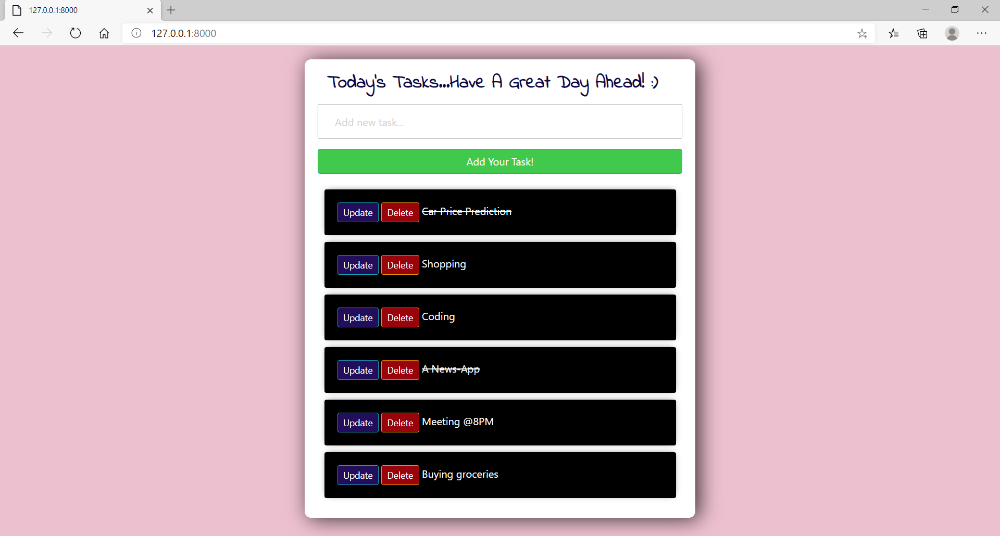

# ToDo-Web-App

A Todo list App made in Python and the Django framework. User can add, delete and update events.

## Features of Web App
- Create and maintain multiple todo lists
- Strike-off completed Tasks
- Update existing Todo list
- Delete Todo lists

## Requirements
- Python 3.x

You can download Python [here](https://www.python.org/downloads/).

- Django 3.x

You can download Django [here](https://www.djangoproject.com/download/).

## Usage:

You should start cloning this repository:

    $ git clone https://github.com/Nishantraj140/ToDo-Web-App.git

After downloading the repository, you must run **manage.py** script with **python** like this:

    $ python manage.py runserver
    
After the server is up and running go to the web url provided by Django to view the web app in any broswer.
